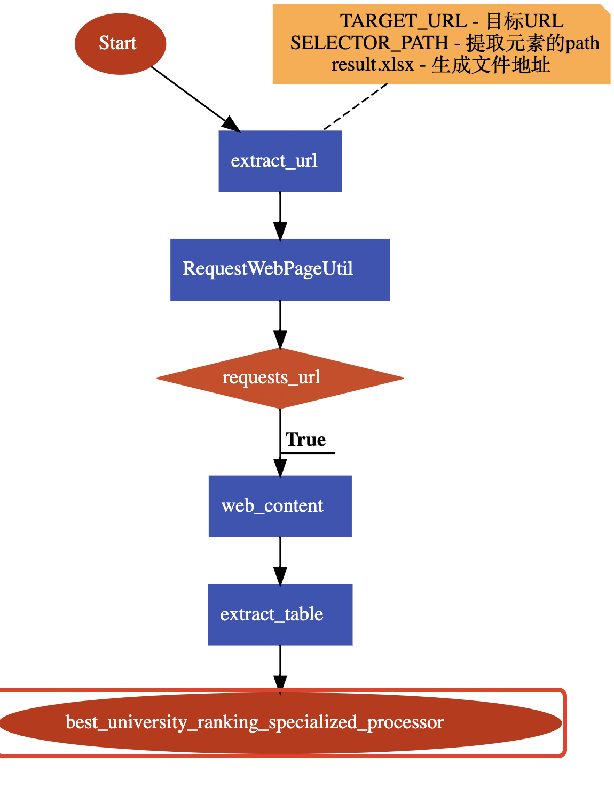

## best_university_ranking_spider

### 功能描述：

1. 输入：大学排名URL链接
(URL: http://www.zuihaodaxue.cn/zuihaodaxuepaiming2019.html)
2. 爬取内容：排名、学校名称、省市、总分
3. 输出：大学排名信息的屏幕输出以及相关信息保存在"result.xlsx"文档

### Setup && Run

```
make install 
python best_university_ranking_spider.py
```

代码执行完成后，会在当前目录下产生一个`result.xlsx`文件。


### 结构


